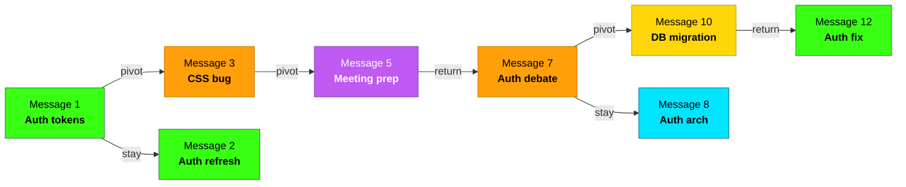
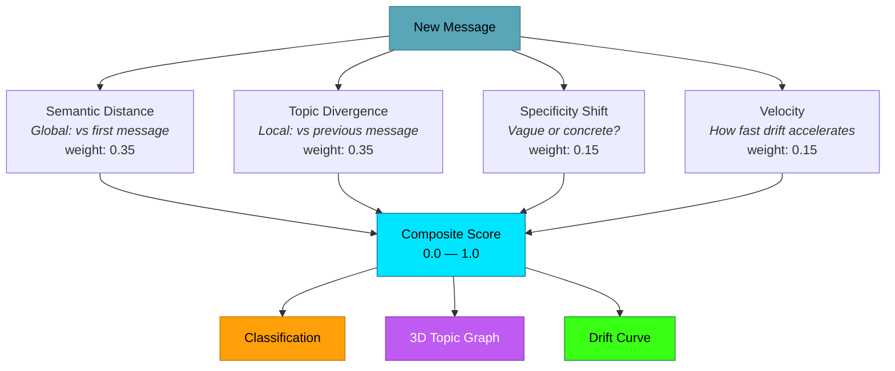
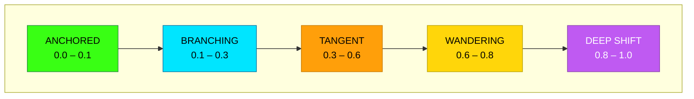

<p align="center">
  <picture>
    <source media="(prefers-color-scheme: dark)" srcset="docs/assets/header-dark.svg">
    <source media="(prefers-color-scheme: light)" srcset="docs/assets/header-light.svg">
    
  </picture>
</p>

<p align="center">
  <a href="LICENSE.md"></a>
  
  
</p>

---

## The Problem

ADHD conversations don't follow a straight line. You start on auth tokens, pivot to a CSS bug, remember a meeting, circle back, then go deep on architecture. **That's not a bug — it's how your brain works.**

But it's invisible. You finish a session and wonder: *how many topics did I actually touch? Where did I drift? Did I ever come back?*

**ADHD Drift Visualizer answers those questions.** Feed it a chat session and it maps every topic pivot, scores how far you drifted, and shows you the shape of your conversation.

## How It Works

Feed it a conversation. It scores every message for drift from your starting topic and builds a relational graph of how your thinking moved.



### Signal Pipeline

Four signals measure different aspects of each message, then combine into one drift score:



### 5-Tier Classification

Each message gets classified — no judgment, just a description of distance from the starting topic:



### Pivots are data, not deficits

The visualizer doesn't judge. A session with 8 pivots isn't "worse" than one with 0. It's **different**. The goal is awareness — see your patterns, understand them, and use that knowledge however you want.

> [!IMPORTANT]
> This tool is **not a diagnostic instrument**. It does not diagnose, treat, or assess any medical or psychological condition. It visualizes context-switching patterns in conversations — nothing more.

## Quick Start

```bash
git clone https://github.com/qinnovates/ADHD-drift-visualizer.git
cd ADHD-drift-visualizer
pip install -e ".[ui,voyage]"   # or [ui,openai] or [ui,local]

# Run the demo
adhd-drift demo

# Analyze a chat session
adhd-drift analyze session.md --human

# Launch the dashboard
adhd-drift serve
# Open http://127.0.0.1:3457
```

## Features

| Feature | Description |
|---------|-------------|
| **4-Signal Scoring** | Multi-signal drift scoring optimized for conversation topic tracking |
| **Topic Labeling** | Auto-extracts topic labels for each message |
| **Pivot Detection** | Identifies exact messages where topic shifted |
| **Focus Streak** | Longest run of anchored/branching messages |
| **Topic Flow** | Visual timeline of topic changes with color-coded drift |
| **Refocus Suggestions** | ADHD-aware, non-judgmental suggestions to get back on track |
| **Chat Parsers** | Import from Claude Code, ChatGPT, or markdown conversation logs |
| **Historical Mode** | Analyze MEMORY.md files for cross-session patterns |
| **3D Topic Graph** | Interactive WebGL graph showing how topics connect and where your thinking steers |
| **Dashboard** | Real-time visualization with drift curve, 3D graph, topic flow |
| **Pluggable Embeddings** | Voyage AI, OpenAI, or local — use what you already have |
| **CLI** | `adhd-drift analyze`, `serve`, `demo`, `history` — fits into your workflow |

## Chat Log Formats

Upload or point at any of these:

| Format | File Extension | Source |
|--------|---------------|--------|
| Claude Code JSONL | `.jsonl` | `~/.claude/history.jsonl` |
| ChatGPT Export | `.json` | ChatGPT Settings > Data Controls > Export |
| Markdown | `.md`, `.txt` | Any `User: / Assistant:` formatted conversation |

## Claude Code Skill

If you use [Claude Code](https://claude.ai/code), install the skill for in-session analysis:

```bash
# Install the library
pip install -e /path/to/ADHD-drift-visualizer

# Copy the skill
cp -r skills/adhd-drift ~/.claude/skills/adhd-drift
```

Then use it in any session:

```
/adhd-drift                          # Analyze the current session
"analyze my drift"                   # Same thing, natural language
"what do I keep coming back to"      # Cross-session memory analysis
"show my topic graph"                # Launch 3D interactive graph
```

> [!NOTE]
> The skill asks for consent before reading memory files or conversation history. Your data stays local — nothing is transmitted or persisted beyond the session.

## 3D Topic Graph

The dashboard includes an interactive WebGL topic graph showing how your thinking steers between subjects:

- **Nodes** = topics, sized by how often you visit them
- **Edges** = transitions between topics, with directional particles showing flow
- **Colors** = drift classification (green=anchored, cyan=branching, orange=tangent, yellow=wandering, purple=deep shift)
- **Orbit, zoom, hover** for details

Launch it: `adhd-drift serve` then open `http://127.0.0.1:3457` and load a session.

## Use Cases

- **Self-awareness**: See how your conversations actually flow vs how you think they flow
- **Session retrospectives**: "I touched 7 topics but only completed 2 — what do I prioritize tomorrow?"
- **Pair programming**: Visualize drift in real-time during a coding session
- **Meeting analysis**: Score whether a standup stayed focused or went on tangents

---

<details>
<summary><strong>Architecture</strong></summary>

```
src/adhd_drift/
├── engine.py          # DriftEngine — orchestrates all components
├── scorer.py          # 4-signal composite scoring
├── classifier.py      # 5-tier classification
├── tracker.py         # Cumulative drift + pivot detection
├── recovery.py        # Recovery score + refocus suggestions
├── embeddings.py      # Pluggable embedding providers
├── signals.py         # Specificity shift signal
├── topics.py          # Topic extraction + labeling
├── types.py           # Shared dataclasses and enums
├── demo.py            # Sample session
├── history.py         # Cross-session memory analysis
└── parsers/
    ├── claude.py      # Claude Code JSONL
    ├── chatgpt.py     # ChatGPT export JSON
    └── markdown.py    # Generic markdown

ui/
├── dashboard.html     # Single-file dashboard
└── server.py          # Flask dev server
```

</details>

<details>
<summary><strong>Configuration</strong></summary>

### Signal Weights

| Signal | Default Weight | Tune Up For |
|--------|---------------|-------------|
| `semantic_distance` | 0.35 | Tasks where staying on-topic matters most |
| `topic_divergence` | 0.35 | Detecting subject changes |
| `specificity_shift` | 0.15 | Catching when messages get vague |
| `velocity` | 0.15 | Real-time monitoring, alerting |

### Tolerance Profiles

| Profile | Max Drift | Alert At | Best For |
|---------|-----------|----------|----------|
| Strict | 0.15 | 0.10 | Task-focused deep work |
| Standard | 0.30 | 0.25 | Normal conversation |
| Creative | 0.60 | 0.50 | Brainstorming |
| Freeform | 0.80 | 0.70 | Stream of consciousness |

</details>

---

## Development

```bash
pip install -e ".[dev]"
ADHD_DRIFT_EMBEDDINGS=local pytest
ruff check src/
python -m adhd_drift.demo
```

## License

[MIT](LICENSE.md)

---

<p align="center">Built by <a href="https://github.com/qinnovates">qinnovates</a></p>
